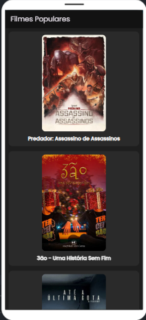
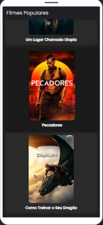
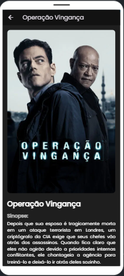
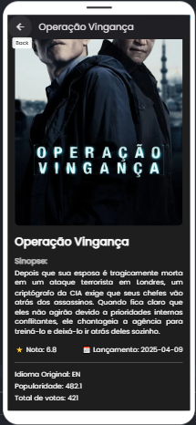

# 🎬 Cineminha

O **Cineminha** é um aplicativo mobile desenvolvido em **Flutter**, que exibe os filmes mais populares do momento utilizando dados da **API pública TMDB (The Movie Database)**.

Este projeto foi desenvolvido como parte da disciplina de **Desenvolvimento para Dispositivos Móveis (2º Bimestre)**.


## 📚 Introdução ao App:

Ao iniciar o aplicativo, o usuário é direcionado para a tela **Home**, onde são exibidos os filmes populares do momento com suas capas.

Cada filme apresenta:

- Capa do filme
- Nome do filme

**Ao passar o mouse sobre o filme (na versão web):**

- Há uma leve animação de zoom + mudança de cor de fundo, criando uma experiência interativa.

**Ao clicar em qualquer filme:**

O usuário é redirecionado para a tela de **detalhes**, onde poderá visualizar:

- Nome completo do filme
- Imagem em alta qualidade
- Sinopse (overview)
- Nota de avaliação
- Data de lançamento
- Idioma original
- Popularidade
- Total de votos


## 📱 Tecnologias utilizadas:

- **Flutter**
- **Dart**
- **HTTP (para requisições API)**
- **Google Fonts**
- **Flutter Web**
- **Firebase Hosting (para deploy online)**
- **TMDB API (The Movie Database)**


## 📷 Imagens da aplicação

**Utilizando o APP**


<br/><br/>

**Tela Principal:**



<br/><br/>

**Tela de detalhes do filme:**



<br/><br/>


## 💻 Como rodar o projeto localmente:

### Requisitos:

- Flutter instalado (https://flutter.dev/docs/get-started/install)
- Conta no TMDB para gerar uma API Key (https://www.themoviedb.org/)

### Passos:

1. Clone o repositório:

```bash
git clone https://github.com/guilhermesandrade/Cineminha
cd cineminha
```
Instale as dependências:

```bash
flutter pub get
```

Configure sua API Key:

Crie o arquivo: assets/env.json

Com o seguinte conteúdo:

```bash
{
  "TMDB_API_KEY": "SUA_CHAVE_DA_TMDB_AQUI"
}
```

Rode o projeto:

```bash
flutter run -d chrome
```


## 📚 Funcionalidades

✔️ Consumo da API TMDB

✔️ Listagem de filmes populares

✔️ Tela de detalhes com informações completas

✔️ Navegação entre telas

✔️ Animações de hover nos cards

✔️ Deploy Web com Firebase Hosting
## 🌐 Link para testar a aplicação Web
👉 <a href="https://cineminha-edbe3.web.app/">Clique aqui para acessar o app online</a>


## 🔰 Código Fonte:

Todo o código Dart está devidamente versionado e organizado dentro da pasta `/lib`.

**Principais arquivos e pastas:**

lib/

├── main.dart → Configuração geral do app e tema

├── models/

│ └── movie.dart → Modelo de dados para os filmes

├── pages/

│ ├── home_page.dart → Tela inicial com a listagem dos filmes

│ └── movie_detail_page.dart → Tela de detalhes do filme selecionado

├── services/

│ └── movie_service.dart → Requisição de dados da API TMDB

└── widgets/

└── movie_card.dart → Componente de card de filme com animação de hover
